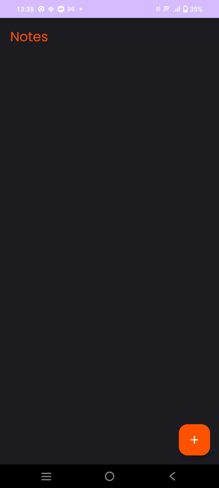
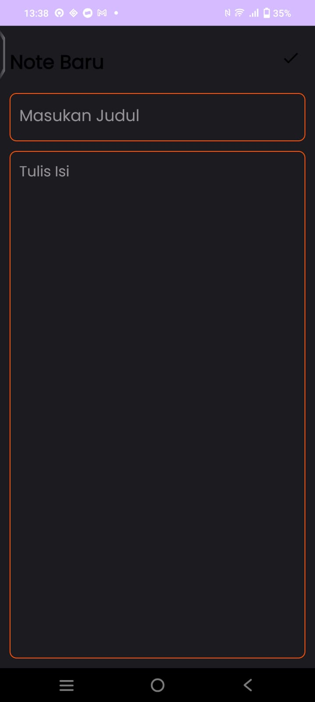
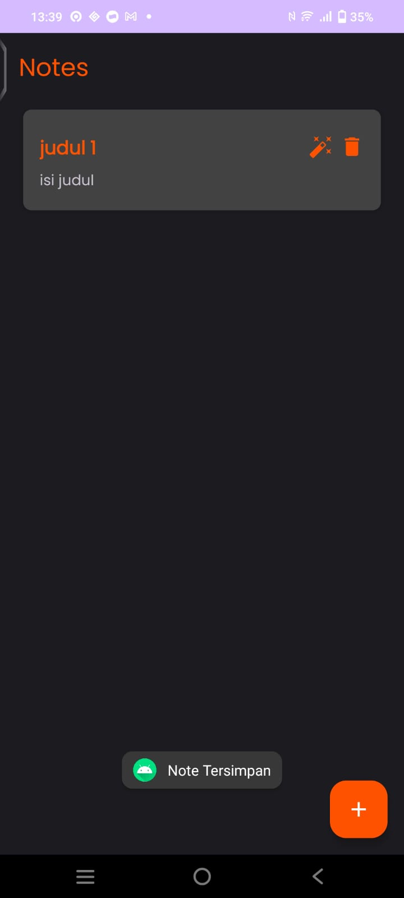
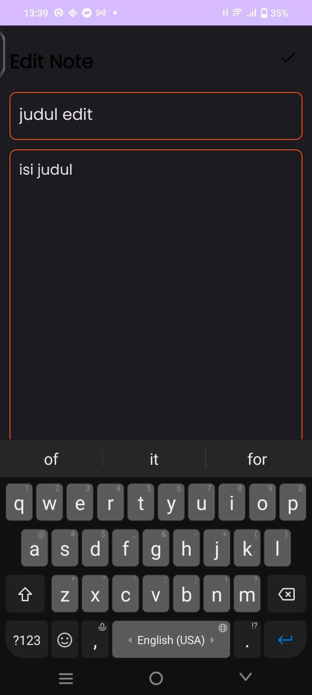
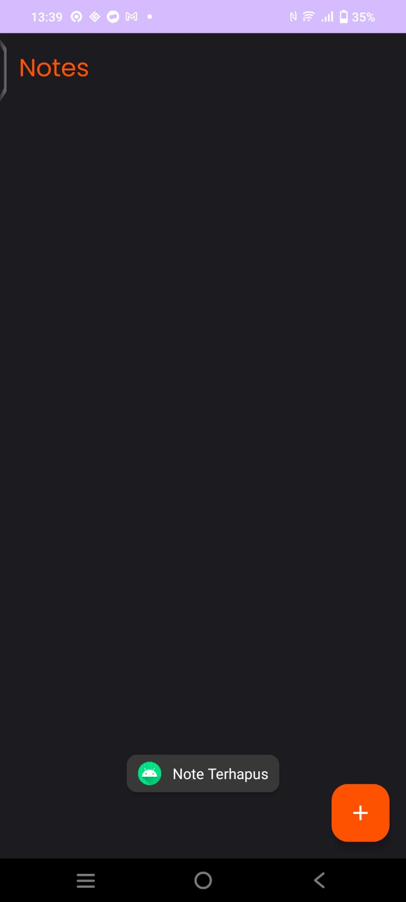

# UAS Mobcom
**Nama : Galang Kurniadhi**  
**NIM : 1313620036**
**Link : https://youtube.com/shorts/A5B2bY5v9I0?si=lRckVm3XbElZVIj6**
## Latar Belakang
  
Pengembangan aplikasi catatan pada platform Android muncul sebagai solusi untuk memenuhi kebutuhan mobilitas pengguna modern yang sering berpindah-pindah. Aplikasi ini dirancang untuk memberikan pengalaman pengguna yang efisien dan praktis dalam mencatat, mengorganisir, dan mengakses informasi penting. Dengan fokus pada fleksibilitas, sinkronisasi antar perangkat, dan pencarian cepat, aplikasi catatan memungkinkan pengguna untuk dengan mudah menyusun dan mengelola informasi mereka, baik berupa teks, gambar, atau daftar tugas. Tujuannya adalah meningkatkan produktivitas dan memudahkan pengguna dalam menjaga keberlanjutan tugas sehari-hari, memastikan aksesibilitas informasi di mana pun dan kapan pun diperlukan.

## Fitur-Fitur
- **Home page**
    
  Berikut adalah tampilan Homepage yang warna backgroundnya mengikuti setting default dari device, Device pada gambar menggunakan Dark Theme.
  
- **Create Note**
    
    
  Fitur ini memperbolehkan user untuk membuat Note baru yang terdiri atas Judul dan Isi Note.

- **Update Note**
    
  Fitur ini memperbolehkan user untuk merubah Note yang sudah ada.

- **Delete Note**
    
  Fitur ini memperbolehkan user untuk menghapus note yang ada.
